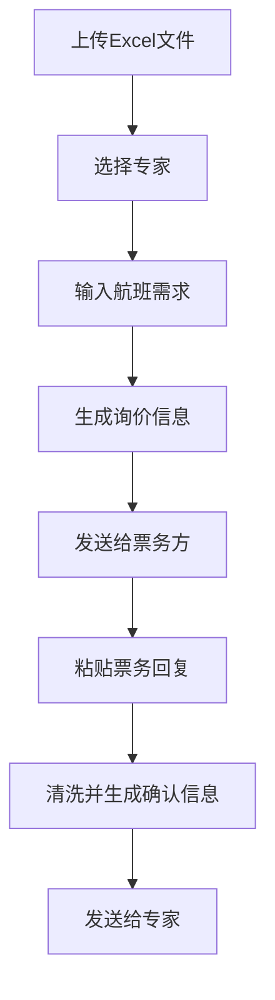

## 1. Product Overview
智能会务机票助手是一款桌面Web应用工具，旨在自动化处理机票预订中的信息流转。该工具解决会务人员在Excel表格、微信等多个平台之间手动复制、粘贴和修改信息的痛点，提升效率、降低错误率、保障信息安全。
- 目标用户：负责会务协调、专家接待的运营或行政人员，技术背景较弱但熟练使用Office办公软件
- 产品价值：将重复的手动操作自动化，确保含有价格的敏感信息不会被误发给专家

## 2. Core Features

### 2.1 User Roles
本产品为单用户工具，无需用户角色区分。

### 2.2 Feature Module
我们的智能会务机票助手包含以下主要页面：
1. **主页面**：文件上传区域、专家选择区域、询价生成区域、票务回复处理区域

### 2.3 Page Details

| Page Name | Module Name | Feature description |
|-----------|-------------|---------------------|
| 主页面 | 文件上传模块 | 上传Excel文件，校验文件格式和必要列（姓名*、身份证、手机号码），解析专家信息并加载到内存 |
| 主页面 | 专家选择模块 | 下拉选择框显示所有专家姓名，选择后自动填充专家的姓名、身份证、手机号码信息 |
| 主页面 | 询价生成模块 | 手动输入航班需求，点击按钮生成标准化询价文本，提供一键复制功能 |
| 主页面 | 票务回复处理模块 | 粘贴原始票务反馈，自动清洗价格和敏感代码，生成格式化确认信息，提供一键复制功能 |

## 3. Core Process
用户操作流程如下：
1. 上传包含专家信息的Excel文件
2. 从下拉列表选择专家，系统自动填充个人信息
3. 手动输入航班需求，生成询价信息并复制发送
4. 将票务方回复粘贴到系统，清洗处理后生成确认信息并复制发送给专家

## 4. User Interface Design
### 4.1 Design Style
- 主色调：蓝色系（#1f77b4）和灰色系（#f8f9fa）
- 按钮样式：圆角矩形，蓝色背景，白色文字
- 字体：系统默认字体，标题16px，正文14px
- 布局风格：单页面垂直布局，卡片式分区设计
- 图标风格：简洁的线性图标

### 4.2 Page Design Overview

| Page Name | Module Name | UI Elements |
|-----------|-------------|-------------|
| 主页面 | 文件上传模块 | 文件拖拽上传区域，支持.xlsx格式，上传状态提示，错误信息显示 |
| 主页面 | 专家选择模块 | 下拉选择框，三个只读文本框显示专家信息（姓名、身份证、手机号） |
| 主页面 | 询价生成模块 | 多行文本输入框（航班需求），生成按钮，只读代码区域显示结果，复制按钮 |
| 主页面 | 票务回复处理模块 | 大型多行文本输入框，处理按钮，只读代码区域显示清洗结果，复制按钮 |

### 4.3 Responsiveness
桌面优先设计，主要适配1920x1080和1366x768分辨率，支持基本的响应式布局以适应不同屏幕尺寸。