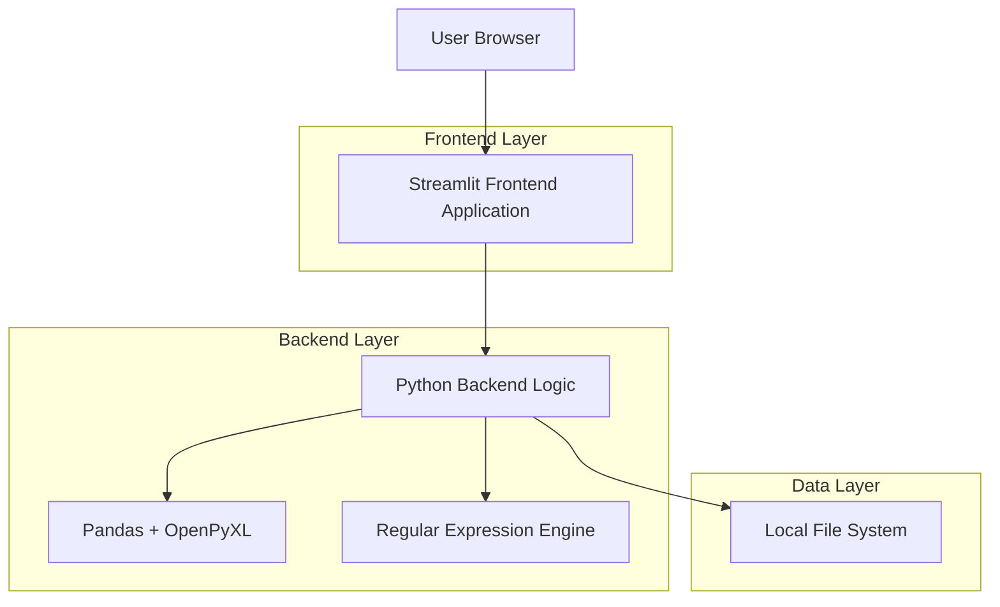
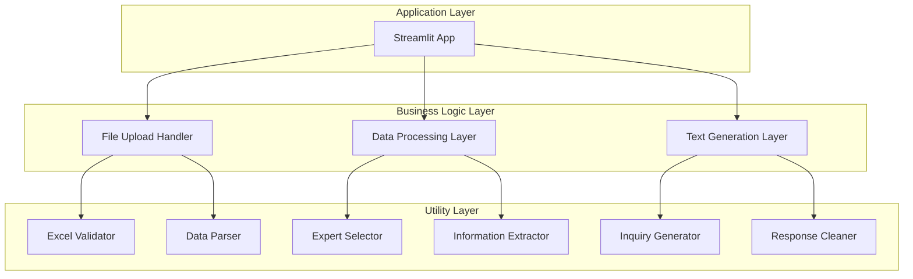
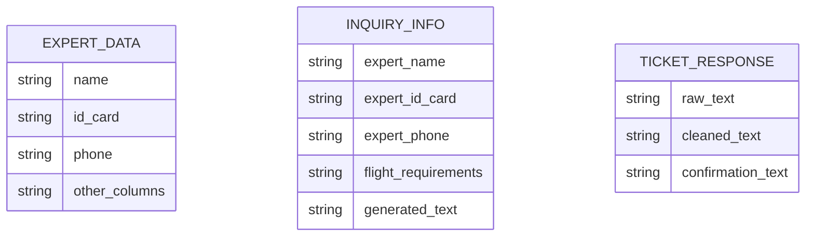

## 1.Architecture design



## 2.Technology Description

* Frontend: Streamlit\@1.28+ (提供Web界面)

* Backend: Python\@3.8+ + pandas\@2.0+ + openpyxl\@3.1+ + re (内置正则表达式)

* 运行方式: 本地启动，通过 `streamlit run app.py` 访问

## 3.Route definitions

| Route | Purpose            |
| ----- | ------------------ |
| /     | 主页面，包含所有功能模块的单页面应用 |

## 4.API definitions

### 4.1 Core Functions

文件处理相关

```python
def validate_excel_file(uploaded_file) -> tuple[bool, str, pd.DataFrame]
```

参数:

| Param Name     | Param Type   | isRequired | Description      |
| -------------- | ------------ | ---------- | ---------------- |
| uploaded\_file | UploadedFile | true       | Streamlit上传的文件对象 |

返回值:

| Param Name | Param Type   | Description |
| ---------- | ------------ | ----------- |
| is\_valid  | boolean      | 文件是否有效      |
| message    | string       | 验证结果消息      |
| dataframe  | pd.DataFrame | 解析后的数据框     |

询价信息生成

```python
def generate_inquiry_text(name: str, id_card: str, phone: str, requirements: str) -> str
```

参数:

| Param Name   | Param Type | isRequired | Description |
| ------------ | ---------- | ---------- | ----------- |
| name         | string     | true       | 专家姓名        |
| id\_card     | string     | true       | 身份证号        |
| phone        | string     | true       | 手机号码        |
| requirements | string     | true       | 航班需求        |

返回值:

| Param Name    | Param Type | Description |
| ------------- | ---------- | ----------- |
| inquiry\_text | string     | 格式化的询价文本    |

票务回复清洗

```python
def clean_ticket_response(raw_text: str) -> str
```

参数:

| Param Name | Param Type | isRequired | Description |
| ---------- | ---------- | ---------- | ----------- |
| raw\_text  | string     | true       | 原始票务回复文本    |

返回值:

| Param Name    | Param Type | Description |
| ------------- | ---------- | ----------- |
| cleaned\_text | string     | 清洗后的确认文本    |

## 5.Server architecture diagram



## 6.Data model

### 6.1 Data model definition



### 6.2 Data Definition Language

由于本项目使用内存数据处理，不涉及持久化数据库，以下为数据结构定义：

Excel文件数据结构

```python
# 必需列名
REQUIRED_COLUMNS = [
    "姓名*",
    "身份证(出机票必须填写)", 
    "手机号码(必填)"
]

# 数据验证规则
VALIDATION_RULES = {
    "file_format": ".xlsx",
    "max_file_size": "10MB",
    "max_rows": 1000,
    "required_columns": REQUIRED_COLUMNS
}
```

文本清洗正则表达式

```python
# 价格清洗规则
PRICE_PATTERNS = [
    r'\d+\s*元',           # 1160元, 1160 元
    r'价格\s*\d+',         # 价格1160, 价格 1160
    r'\d+\s*RMB',          # 1160RMB
    r'￥\s*\d+',           # ￥1160
]

# PNR码清洗规则
PNR_PATTERN = r'\b[A-Z0-9]{6}\b'  # 6位字母数字组合

# 格式整理规则
FORMAT_RULES = {
    "remove_empty_lines": r'\n\s*\n',
    "trim_whitespace": r'^\s+|\s+$'
}
```

